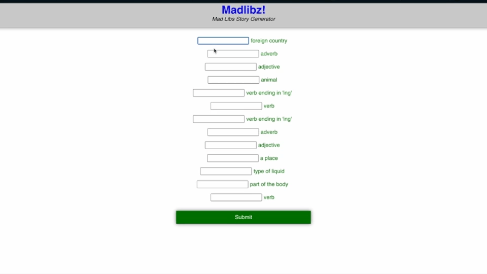

# React Assessment #1

## Part 1: Conceptual

- Answer the following questions in conceptual.

[conceptual](/conceptual.md)

## Part 2: addCommas

- Write a function called addCommas which accepts a number and converts it into a string formatted with commas added for readability.
- Write tests for these (non-bonus) cases and make sure your code passes these. Feel free to add any other tests you deem necessary.

## Part 3: React Madlibs

- Make a madlibs game in react

Demo:



### Skills/tools/technologies in Madlibs

- React.js using the [Create React App](https://github.com/facebook/create-react-app)
- JavaScript
- CSS
- Form validation
- Controlled components
- Styled components
- API call using fetch

The API used in this project is [Madlibz API](https://madlibz.herokuapp.com/api).

#### Getting Started

##### Available Scripts

In the project directory, you can run:

```bash
npm start
```

Runs the app in development mode.
Open [http://localhost:3000](http://localhost:3000) to view it in your browser.

The page will reload when you make changes.
You may also see any lint errors in the console.

```bash
npm build
```

Builds the app for production to the `build` folder.
It correctly bundles React in production mode and optimizes the build for best performance.

The build is minified and the filenames include the hashes.
Your app is ready to be deployed!

See the section about [deployment](https://facebook.github.io/create-react-app/docs/deployment) for more information.

```bash
npm eject
```
**Note: this is a one-way operation. Once you `eject`, you can't go back!**

If you aren't satisfied with the build tool and configuration choices, you can `eject` at any time. This command will remove the single build dependency from your project.

Instead, it will copy all the configuration files and the transitive dependencies (webpack, Babel, ESLint, etc) right into your project so you have full control over them. All of the commands except `eject` will still work, but they will point to the copied scripts so you can tweak them. At this point you're on your own.

You don't have to ever use `eject`. The curated feature set is suitable for small and middle deployments, and you shouldn't feel obligated to use this feature. However we understand that this tool wouldn't be useful if you couldn't customize it when you are ready for it.

#### Learn More

You can learn more in the [Create React App documentation](https://facebook.github.io/create-react-app/docs/getting-started).

To learn React, check out the [React documentation](https://reactjs.org/).


